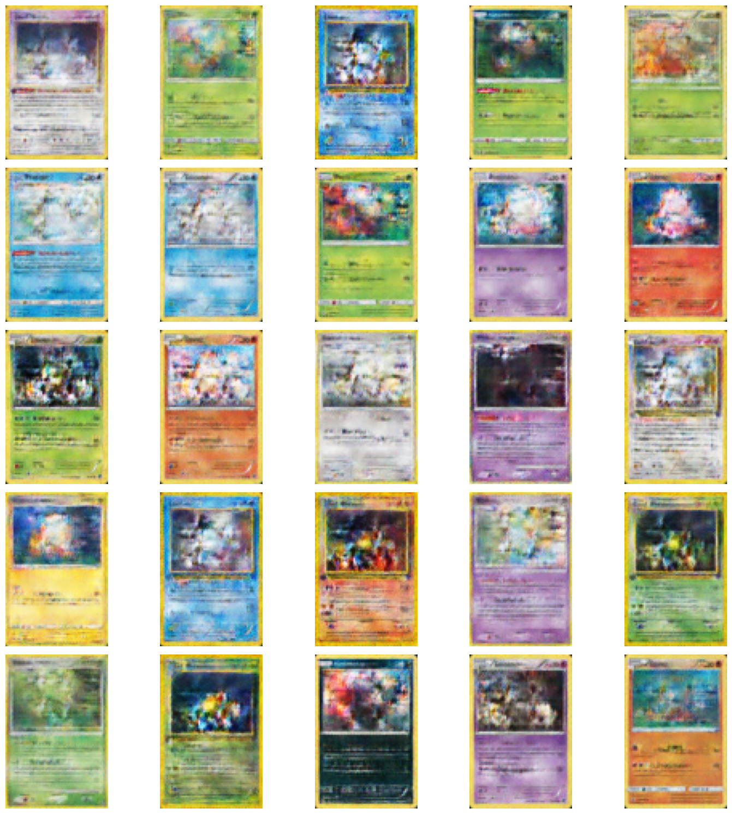
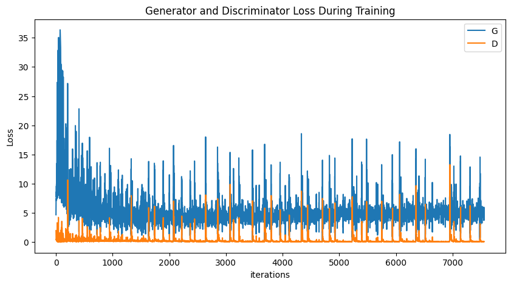
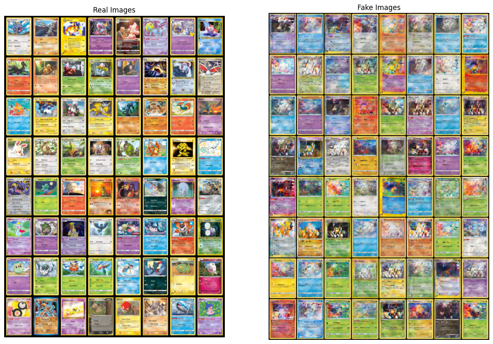

# 🃏 DCGAN Pokémon Card Generator

🎨 **Generate traditional-style Pokémon cards using Deep Convolutional Generative Adversarial Networks (DCGANs).**


https://github.com/user-attachments/assets/eb3bcb9f-1ed4-4117-a42d-87644b96ebe0


 

## 📖 Overview

This project utilizes a DCGAN to create realistic Pokémon cards, focusing on traditional designs from the Pokémon Trading Card Game. The model generates visually convincing cards by training on a dataset of over 11,000 card images spanning all generations, excluding full-art types like EX and GX to maintain a focus on the classic card format.


---

## 🚀 Features

- Generate unique, traditional-style Pokémon card designs.
- Trained on a dataset of over 11,000+ Pokémon cards with consistent rectangular dimensions (600x825 pixels).
- Built with PyTorch and trained on an NVIDIA GeForce RTX 3050 (4GB).

---

## 🖼️ Dataset

- **Source:** [Pokemon TCG Dataset](https://github.com/PokemonTCG/pokemon-tcg-data)
- **Size:** 11,044 preprocessed images
- **Preprocessing Steps:**
  - Verified image validity and removed invalid or incompatible files.
  - Resized images to consistent dimensions of **600x825 pixels**.
  - Converted images to RGB mode for uniformity.

 

---

## 🧠 Model Architecture

### Generator
- Takes a 100-dimensional latent vector (`z`) and outputs a full-color image (96x64 pixels).
- Architecture:
  - 5 transposed convolutional layers.
  - Batch normalization for stability.
  - Final activation: `Tanh`.

### Discriminator
- Classifies input images (96x64 pixels) as real or fake.
- Architecture:
  - 5 convolutional layers.
  - Leaky ReLU activations.
  - Final activation: `Sigmoid`.

Both models use custom weight initialization based on the DCGAN paper.

---

## 📊 Results
- **Loss Graphs:** Generator and Discriminator losses during training:
  
  

- **Turing Test:** The Real Vs Fake:
  
  


---

## ⚡ Challenges and Solutions

- **Rectangular Card Dimensions:** Adjusted the dataset and architecture to handle non-square images.


---

## 🤖 How to Use

1. **Clone this repository**:
   ```bash
   git clone https://github.com/olivergrabner/pokemon-card-dcgan.git

